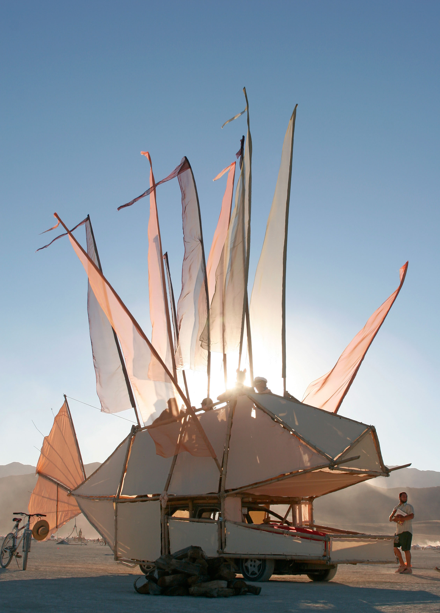
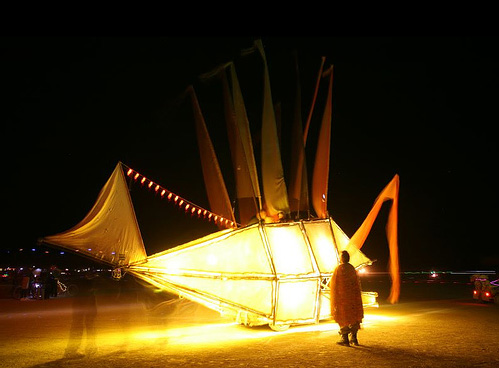
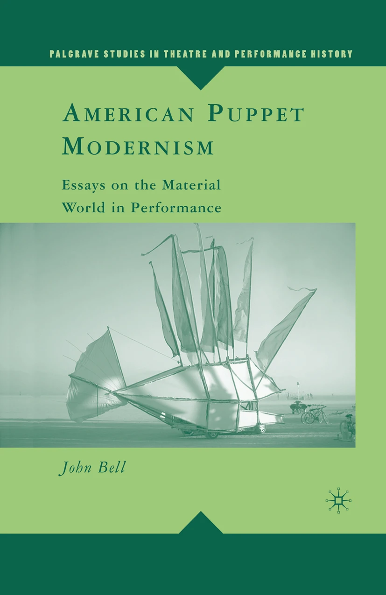

I built two art cars. The first was called Sakana, or just the fish car and the most successful from an artistic perspective, and the second was called Jabba's barge and was the most successful from a fun perspective.

